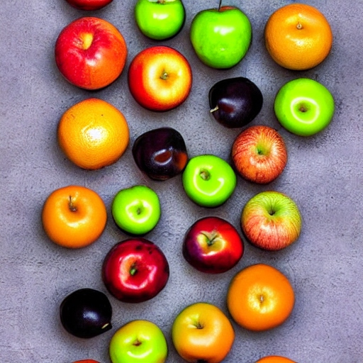

Random Forest Algorithm
The random forest algorithm is like a team of smart trees that work together to make predictions. Let's see how they do it!

Steps of the Algorithm
Data Preparation: First, we gather information about different things. We collect data with features (characteristics) and their answers (target). For example, we can collect data about fruits, like their color, size, and taste, along with whether they are apples or oranges.

Random Sampling: Next, we create a small group from our collected data. We call this group the training set. It's like picking a few fruits randomly from all the fruits we have.

Decision Tree Construction: Now, for each fruit in the training set, we create a special tree. This tree asks questions about the fruit's features, like "Is it red?" or "Is it small?". Based on the answers, the tree decides if the fruit is an apple or an orange.

Feature Randomness: The trees like to be unique, so they only ask certain questions about the fruits. They don't ask about every feature every time. They choose some features randomly to make their own decisions.

Ensemble of Decision Trees: We create many trees using different fruits from the training set. Each tree is unique and makes its own guesses about whether a fruit is an apple or an orange.

Prediction: When we want to know about a new fruit, we ask each tree in our forest. They all give their opinions, and then we count the votes. If most trees say it's an apple, we guess it's an apple. If most say it's an orange, we guess it's an orange.

Advantages of Random Forests
They work together and help each other, so they are good at making predictions.
They can handle lots of information about fruits, like their color, size, and taste.
They can tell us which features are more important in deciding if a fruit is an apple or an orange.
They can still make good guesses even if some information about a fruit is missing.
They are quick at making predictions and are very helpful.
Random forests are used in many areas, like figuring out if an email is spam or not, predicting the weather, or even helping doctors diagnose diseases. They are like a team of clever trees working together to solve problems!

I hope this explanation helps you understand the random forest algorithm better!